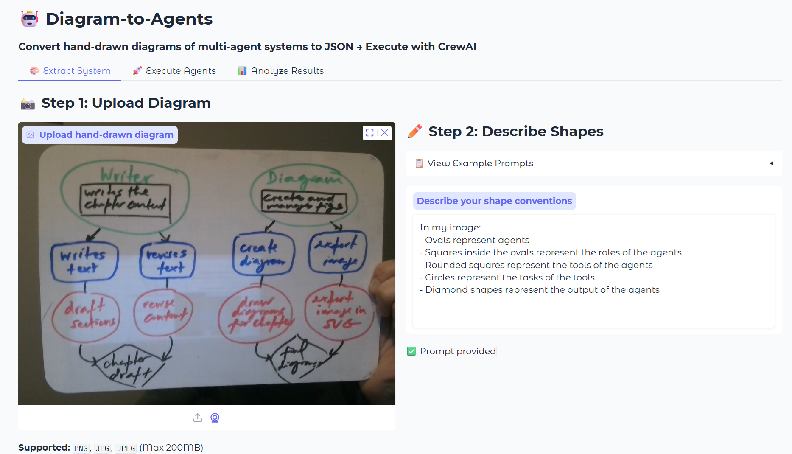

# 🤖 Multi-Agent System Extractor & Executor

Convert hand-drawn diagrams of multi-agent systems to JSON and execute them with CrewAI.

> Adapted from [Building Multi-Agents from Paper 📝 by Hand ✍️](https://www.byhand.ai/p/building-multi-agents-from-paper)



## 🌟 Features

- **📸 Image Upload or Camera Capture**: Upload hand-drawn diagrams or capture them directly with your webcam
- **🔍 AI Extraction**: Use GPT-4o Vision to extract system structure from drawings
- **⚙️ Agent Execution**: Run with CrewAI framework
- **📊 Observability**: Track execution metrics and logs
- **💾 Export Data**: Download extracted JSON and execution logs

## 🚀 Quick Start

1. Install dependencies

```bash
pip install -r requirements.txt
```

2. Set up API Key

```bash
# Option 1: Environment variable
export OPENAI_API_KEY="sk-..."

# Option 2: Use .env file
echo "OPENAI_API_KEY=sk-..." > .env
```

### 3. Run the App

```bash
python app.py
```

The app will be available at `http://localhost:7860`

## 🤝 Contributing

We welcome contributions from the community!

Areas for improvement include:

- Support for more frameworks (LangGraph, LlamaIndex, AutoGen, &c.)
- Better error handling
- Enhanced observability
- Template library for common patterns
- Batch processing

## 📄 License

MIT License - feel free to use and modify!
